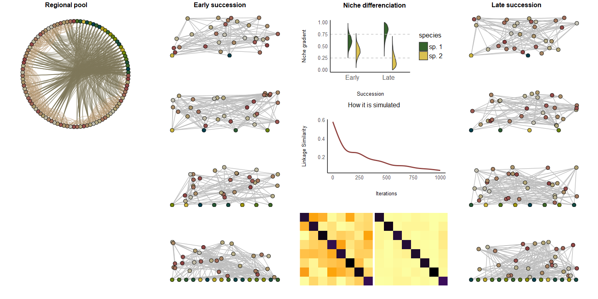
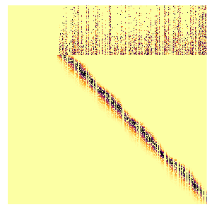
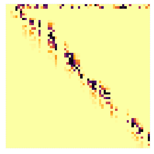
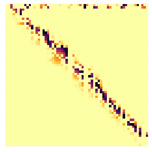
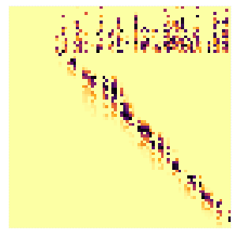
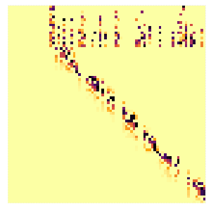

# AssembleDiversiFun
Modeling project examining the effects of producer diversity in early/late succession multi-trophic communities on ecosystem functioning.

regional_local.R creates a regional species pool of 1000 species (250 each of plants, herbivores, omnivores, predators). Bodymasses range from 10^-9g to 10^3g, representing soil organisms from nematodes to small mammals. Herbivorous interactions, including herbivory by omnivores, have a nested pattern with some plants consumed by most plant consumers, while others by only few and some plant consumers consuming most plant species while others only few of them. Plant consumers are randomly selected across the body size range, then omnivores are sampled from plant consumers with a probability that depends on the fraction of plants that a species consumes (so omnivores are more likely than herbivores to be generalists). Predatory interactions are allometric, following Schneider (2016) but with an optimal predator prey mass ratio of 0.6 on the log scale, wich is typical of terrestrial invertebrates (Brose et al., 200?). The resulting interaction matrix is thinned by randomly removing 30% of the produced interactions. This produces a meta-foodweb where allometry does not absolutely determine consumption.

Local communities of 2, 4, 8, 16 plant species and 60 animal species (1000 for each plant diversity level) are produced by sampling the regional species pool while ensuring that all species have at least one resource in the local community (following Bauer et al., 2022). The produced food-webs represent communities in early successional stages, where species occurence is most contingent on the presence of their resources. For each of the "early succession" communities, a "late succession" community is produced by removing species with a probability that depends on their linkage similarity to other local species (operating as a proxy of niche overlap) and replacing them with species from the regional pool. This proceeds iteratively, with the use of a Metropolis-Hastings optimisation algorithm, so that eventually we arrive to a community composition of reduced similarity among the local species (Bauer et al., 2022), representative of communities of late successional stages, where competitive exclusion is at play.

  
  

  
  

