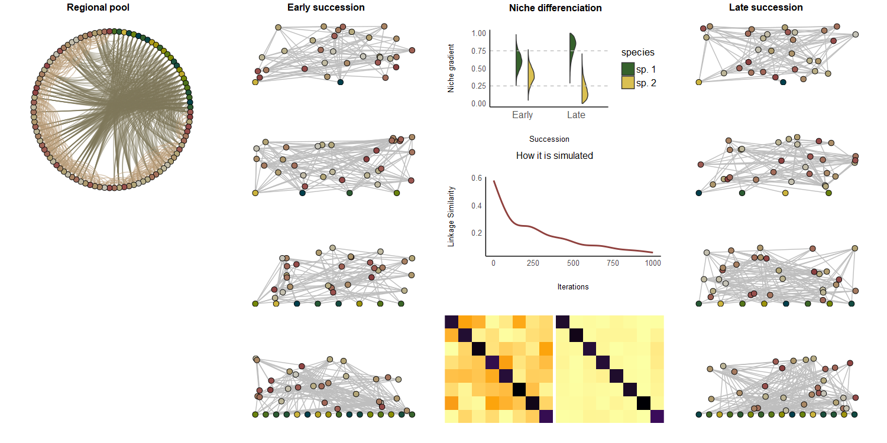

```{r setup, include=FALSE}
knitr::opts_chunk$set(echo = TRUE)
```

### Introduction

[soon]

### Methods



#### Regional species pool

We generated a regional species pool of 1000 species (250 each of plants,
herbivores, omnivores, predators). Body-masses range from $10^{-9}$g to $10^3$g,
representing soil organisms from nematodes to small mammals. We arranged
herbivorous interactions, including herbivory by omnivores, to have a nested
pattern with some plants consumed by most plant consumers, while others by only
few and some plant consumers consuming most plant species while others only few
of them. Plant consumers were randomly selected across the body size range, then
omnivores were sampled from plant consumers with a probability that depends on
the fraction of plants that a species consumes (so herbivores are more likely
than omnivores to be specialists). Predatory interactions are allometric,
following [@schneider2016] but with an optimal predator-prey mass ratio of 0.6
on the log scale, which is typical of terrestrial invertebrates [@brose2006].
The resulting interaction matrix was thinned by randomly removing 30% of the
produced interactions. This produced a meta-foodweb where allometry does not
absolutely determine consumption.

#### Local communities

###### **Animal linkage similarity**

Local communities of 2, 4, 8 or 16 plant species and 40 animal species (1000
replicates for each plant diversity level) are produced by sampling the regional
species pool, while ensuring that all species have at least one resource in the
local community (following @bauer2022). The produced food-webs represent
communities "without history", where species occurrence is most contingent on
the presence of their resources.

For each one of the communities described above, we produced an alternative
community "with history" by removing species with a probability that depends on
their linkage similarity to other local species (operating as a proxy of niche
overlap) and replacing them with species from the regional pool. This proceeds
iteratively, with the use of a Metropolis-Hastings optimization algorithm, so
that eventually we arrive at a community composition of reduced similarity among
the local species [@bauer2022], representative of communities structured by
history, where competitive exclusion is at play.

The local communities were generated by sampling from the regional pool using
the *assembly* package [citation].

###### **Plant competition**

To simulate the effects of niche differentiation on plants, we directly
manipulated the plant-plant interaction matrix (see next section) to produce
communities with different plant competition scenarios. For each local
community, we first generated a plant competition matrix that corresponds to
high niche overlap among species i.e. the competition that each species
experiences from all other species can be as high as the competition from
con-specifics (fig.). Then we generated a competition matrix that corresponds to
reduced niche overlap but without niche expansion i.e inter-specific competition
is reduced but intra-specific competition increases such that the overall
competition remains the same. Finally, we generated a competition matrix that
corresponds to reduced niche overlap combined with niche expansion such that
species compete less with other species as well as con-specifics.

The combination of 2 animal linkage similarity scenarios crossed with 3 plant
competition scenarios resulted in 6 different versions of a focal community, at
4 levels of plant richness. With 1000 replicates for each combination we get
24,000 food-webs overall.

#### Community dynamics

We simulated community dynamics with a bio-energetic model [@delmas2017a;
@gauzens2022]. Changes in the biomass of plants over time are described by the
equation

$$\frac{dB_i}{dt} = (r_iG_i-x_i)B_i - \sum_{j}x_jy_jB_jF_{ij}$$

The first term in equation (1) describes biomass gains through growth, where
$B_i$ is the biomass of species $i$, $r_i$ is the mass-specific maximum growth
rate, $G_i$ is the net growth rate and $x_i$ is the mass-specific metabolic
rate. The second term describes losses to consumption, where $B_j$ is the
biomass of consumer $j$, $y_j$ is the maximum feeding rate of $j$ relative to
its metabolic rate and $F_{ij}$ is the per unit biomass feeding rate of species
$j$ on species $i$.

The net growth rate of species $i$ is defined as

$$G_i = 1 - \frac{s_i}{K_i}$$

where $K_i$ is the carrying capacity of species $i$. $s_i$ depends on the inter-
and intra-specific competition for resources $a_{ij}$.

$$s_i = \sum_{j}a_{ij}B_j $$

The diagonal elements of matrix $a$ correspond to intra-specific competition
while the off-diagonals to inter-specific competition.

It is by manipulating the relative strengths of the $a_{ij}$ elements that we
implemented the different plant competition scenarios described above. While
restricting row sums to 1, we set $\sum_j a_{ij} \leq a_{ii}$ for the baseline
scenario, $\sum_j a_{ij} << a_{ii}$ for the shift to higher intra-specific
competition. Finally, combining the $a_{ii}$ values of the former scenario with
the $a_{ij}$ values of the later scenario, we produced communities with an
overall decrease in plant competition. In all cases the $a$ matrix was
multiplied by $N$ (number of plant species in the community) such that the
overall competition experienced by one species would sum to $N$ for the first
two competition scenarios, or to a fraction of $N$ for the reduced competition
scenario.

Changes in the biomass of animals over time are described by the equation

$$\frac{dB_i}{dt} = B_i(x_iy_i\sum_{j}F_{ji}e_{j} - X_i) - \sum_{j}x_jy_jB_jF_{ij}$$

The first term in equation () describes biomass gains through consumption (after
metabolic loss?) where $B_i$ is the biomass of species $i$, $F_{ji}$ is the per
unit biomass feeding rate of species $i$ on species $j$, $e_j$ is the
assimilation efficiency of prey $j$. The second term describes losses to
consumption as in eq. 1.

The multi-species (for $k$ species) functional response $F_{ij}$ of species $j$
consuming $i$ is described by the equation

$$F_{ij} = \frac{w_{ij}B_i^q}{B_0^q + c_jB_j + \sum_kw_{kj}B_k^q}$$

where $wij$ is $j$'s relative consumption rate when consuming $i$. $q$ is the
Hill exponent determining the shape of the functional response (type II while
$q = 1$, type III when $q > 1$ and $q\leq2$). $B_0$ is the half-saturation
density while $c_j$ is the intra-specific consumer interference factor.

We simulated community dynamics using the *ATNr* package [@gauzens2022]. We run
simulations for 40,000 time-steps (most communities reached equilibrium at
\~30,000 time-steps).

#### Ecosystem functioning

To assess the effects of competition changes among animals and plants on
ecosystem functioning, we examined the standing plant biomass at the end of
simulations, as well as plant primary productivity (the first term in equation
1). Herbivory pressure on plants was quantified as the total out-flux of energy
(second term in equation 1) from plants to their consumers (including omnivores)
per unit of plant biomass. Finally, we quantified the control of herbivores by
predators as the ratio of out-fluxes over in-fluxes to herbivores [after
@barnes2020].

We present the relationship between plant richness and ecosystem function in
communities "without history" (i.e. unrestricted linkage similarity among
animals and high inter- as well as intra-specific competition among plants), as
a baseline and then we consider the difference in function from that baseline as
the result of the changes in plant or animal competition.

### Results

Out of 24000 simulated communities, 516 (2.15%) had no plant species surviving
at the end of simulated dynamics and were discarded. Communities with a high
initial plant richness had on average a larger proportion of plant and animal
species surviving at the end of simulations (supplement?). This resulted in a
positive plant richness - animal richness relationship.

The simulated communities reproduced the expected positive and saturating plant
richness-productivity relationship (fig. 1), as well as a positive relationship
between richness and standing plant biomass (figSA). When comparing our
scenarios of competition change to a baseline of unrestricted similarity among
animals and high inter-specific as well as intra-specific competition among
plants (fig. 1a), we found that a reduction of similarity (and therefore
competition) among animals had ~~a marginally positive~~ practically no effect
in the richness-productivity relationship (fig1b) (but had a more pronounced
positive effect on the richness-biomass relationship (fig.SAb)).

Changes in plant competition had generally stronger effects. When the change in
competition resulted in plant species competing less with other species but
stronger with con-specifics, there was on average a negative effect on the
richness-productivity relationship across all richness levels (although the
effect was variable at low plant richness and very consistent at high plant
richness) (fig. 1c). By contrast, lowering competition overall in the plant
community led to a consistent relative increase in productivity at higher
richness levels (fig. 1d), corresponding to a steepening of the
richness-diversity slope.

Finally, the combination of reduced animal and plant competition had on average
a positive difference in productivity that was larger at higher plant richness
(fig. 1e). Additionally, the difference in productivity of communities with low
versus high animal competition when plant competition is low (fig. SB), shows
that the reduction in animal competition does have a small contribution to the
relationship shown in fig.1e.

![Figure 1. Primary productivity at equilibrium. (a) Primary productivity at
different levels of initial plant richness for communities with unrestricted
animal similarity and high interspecific plant competition (a). The difference
in productivity relative to (a) when animals are less similar to each other (b),
when plants compete less with other species but stronger with conspecifics (c),
when plants compete less overall (d), b & d combined (e). Black points are mean
values, thick black lines represent the 75% density interval, thin black lines
the 95% density interval.](images/primaryprod.png){#fig:productivity}

$~$

The pressure of herbivory on plants (quantified as total out-fluxes from plants
to their consumers, including omnivores, divided by plant biomass) was lower at
higher richness levels (fig2). The difference in herbivory pressure as a result
of changes in animal or plant competition was highly variable at low plant
richness and diminished at high richness but, overall, competition changes did
not have an effect on the slope or intercept of the richness-herbivory-pressure
relationship (figs 2b-d).

![Figure 2. Herbivory pressure at equilibrium (outfluxes from plants to plant
consumers incl. omnivores divided by plant biomass). (a) Herbivory pressure at
different levels of initial plant richness for communities with unrestricted
animal similarity and high interspecific plant competition (a). The difference
in productivity relative to (a) when animals are less similar to each other (b),
plants compete less with other species but stronger with conspecifics (c),
plants compete less overall (d), b & d combined (e). Black points are mean
values, thick black lines represent the 75% density interval, thin black lines
the 95% density interval.](images/herbivory-02.png)

The control of herbivores by predators (quantified as the ratio of out-fluxes to
in-fluxes of herbivores) had a hump-shaped relationship with plant richness
(fig.3). This was largely the result of no control at the lowest richness level
as a majority of the 2 plant species communities consisted of plants and
herbivores alone with no higher levels surviving. A reduction in animal
competition resulted in a relative increase in herbivory-control on average,
that was more pronounced at intermediate richness levels (fig. 3b). A shift of
plant competition towards stronger intra-specific competition had the opposite
effect (fig. 3c), corresponding to a dampening of the hump-shaped relationship.
Conversely, lower plant competition resulted in a positive difference in
herbivore-control at higher plant richness (fig. 3d). Finally the combined
change of lower animal and plant competition, also had a positive difference in
herbivore control at higher plant richness. Again the contribution of a
reduction of animal competition is clear when comparing the differene in
herbivore control among communities with low versus high animal competition when
plant competition is low (fig. SC).

![Figure 3. Herbivore control at equilibrium (The ratio of outfluxes to influxes
for herbivores) Due to extreme values, plots exclude the top 1% of values . (a)
Herbivory pressure at different levels of initial plant richness for communities
with unrestricted animal similarity and high interspecific plant competition
(a). The difference in productivity relative to (a) when animals are less
similar to each other (b), plants compete less with other species but stronger
with conspecifics (c), plants compete less overall (d), b & d combined (e).
Black points are mean values, thick black lines represent the 75% density
interval, thin black lines the 95% density interval.](images/control.png)

### Discussion

[in the fullness of time]

Our results demonstrate that changes in ecosystem function as communities change
over time largely depend on the exact change in plant species niches and how
this will in turn affect plant competition. If plants respond to inter-specific
competition by restricting their niche, thereby experiencing stronger
competition by con-specifics the effect of change over time would be negative.
If on the other hand plants have the potential to avoid inter-specific
competition by spreading out in niche-space, thereby maintaining low levels of
intra-specific competition, the effect on productivity can be positive.

As a simplifying assumption, we configured plant competition change over time in
a way that implies that the plants' potential of niche expansion is
unconstrained by the number of plant species. In reality, the capacity of
species to avoid overlapping inside a finite niche space will be constrained by
the filling of the niche space and therefore by the number of coexisting
species. The complexity of the niche space (number of dimensions) can also
determine how an increase in species will impact the potential to avoid
competition but regardless of the number of ways that species can differ from
one another, ultimately an increase in richness will saturate the niche space.
The implication is that our two different scenarios of plant competition-change
over time can be seen as two extremes and where exactly natural communities
would fall along this continuum would strongly depend on the number of competing
species.

### References

::: {#refs}
:::

### Appendix {.unnumbered}

![Figure SA. Standing plant biomass at equilibrium. (a) Standing plant biomass
at different levels of initial plant richness for communities with unrestricted
animal similarity and high interspecific plant competition (a). The difference
in biomass relative to (a) when animals are less similar to each other (b), when
plants compete less with other species but stronger with conspecifics (c), when
plants compete less overall (d), b & d combined (e). Black points are mean
values, thick black lines represent the 75% density interval, thin black lines
the 95% density interval.](images/plantbiomass3.png)


